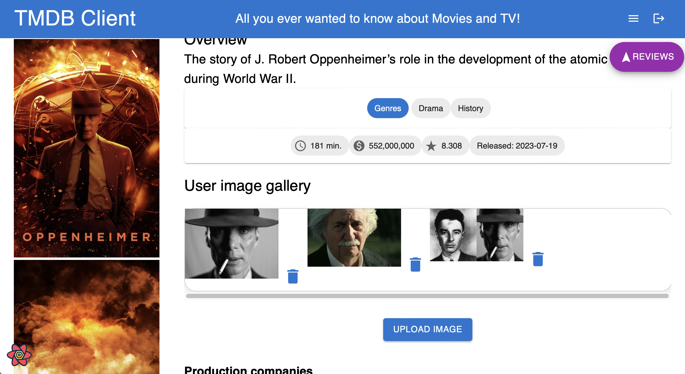

# Full Stack Development 2 - Assignment.

__Name:__ [Darragh Conneely]

## Features.

[A bullet-point list of the features developed for the React SPA app (only new/modified ones for the Movies app),]

### Good

#### UI

+ Upcoming movies page
+ TV discover page
+ Cast details view
+ TV details view

#### Routing

+ Page routes
+ Param URLs for TV details page and Cast details page
+ Data hyperlinking for tv show and cast details

#### Model

+ Additional data entities
	+ TV shows
	+ Cast
+ Server state caching throughout

#### Functionality

+ Filter movies
+ Sort movies
+ Fantasy movie
	+ Title
	+ Overview
	+ Release date
	+ Run time
	+ Genre
	+ Production companies

### Very good

#### UI

+ Links to cast and crew member's movies and visa-versa
+ Links to show's seasons
+ Pagination for movies, tv, favourites, searched and filtered cards

#### Routing

+ Basic token authentication
+ Private routes for premium features:
	+ Fantasy movie page
	+ Favourite movies, tv, cast

#### Functionality

+ Favourite cast and crew
+ Favourite tv shows
+ Multi-criteria search
	+ Year
	+ Genre
	+ Rating floor
	+ Language

#### DevOps

+ Storybook support for components without precedent

### Excellent

#### Model

+ Movie user image gallery
	+ Add gallery
	+ Add images
	+ Delete images

#### Functionality

+ Ordered favourites
	+ Drag and drop grid
+ Themed playlists
	+ Add playlist
		+ Add Title
		+ Add movie to playlist from movie card icon with playlist dropdown selector
		+ Remove movie from playlist with delete icon 
	+ Delete playlist
+ Fantasy movie
	+ Add cast
	+ Upload movie poster

## Feature Design.

#### Upcoming movies page

> Lists movies from the TMDB Upcoming movies endpoint as movie cards.

#### TV discover page

> Lists tv shows from the TMDB Discover TV endpoint as cards.

#### Cast details page

> Displays cast member's profile photo, bio, date and place of birth

#### TV details page

> Displays TV show's posters and metadata: genres, rating, seasons, languages, where to watch

#### Page routes

Public routes:

+ /tvshows - discover tv shows
+ /movies/upcoming - view upcoming movies
+ /movies/search - search movies

#### Param URLs for TV details page and Cast details page

+ /cast/:id - view cast details 
+ /tvshows/:seriesId/season/:seasonNum" - view tv show season details
+ /tvshows/:id - view tv show details
+ /movies/:id - view movie details

#### Data hyperlinking for tv show, cast details

> Links to cast details 

> Links to tv details 

#### Additional data entities

+ TV shows
+ Cast
+ Genres
+ Production companies
+ Movie and tv show images

#### Filter and sort movies

> Filter movies by genre and rating, sort page by most popular, latest, oldest, and rating

#### Fantasy movie

> Add your fantasy movie details such as a title, overview, release date, runtime, genres, and production companies

#### Links to cast and crew member's movies and visa-versa, season links

> Links from cast to their movie details

> Links to season details

#### Pagination for movies, tv, favourites, searched and filtered cards

> Pagination example

#### Basic token authentication for private routes 

> Log in page that appears when you try to access a protected route while unauthenticated

#### Favourite cast and crew

> Lists cast and crew you mark as favourite

#### Favourite tv shows

> Lists tv shows you mark as favourite

#### Multi-criteria search

> Search all movies on TMDB by combining the following search query criteria: year, language, rating, genre.

#### Storybook support for components without precedent

> Storybook example of playlist component

#### Movie user image gallery

> Add an image gallery, then add or delete images (cloudinary support)

#### Ordered favourites

> Drag and drop your favourite movies into an order you like in the grid, then click SAVE ORDER.

#### Themed playlists

> Add a new playlist

> Click icon to add to playlist

> Select your playlist from the dialog

> Lists playlists and you can scroll horizontally through your playlist's movie's, you can delete movies and playlists

#### Fantasy movie

> Add cast to your fantasy movie

> Add poster button

> Cloudinary image upload dialog

> Uploaded movie poster

